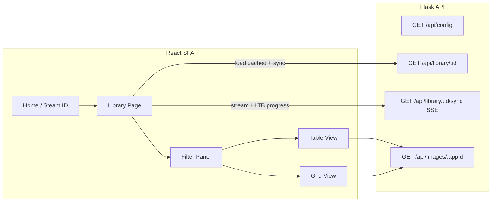
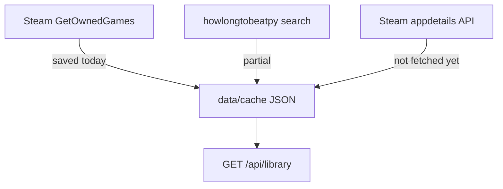

# React Backlog Analyst UI

## Architecture




**Load strategy:** On `/library/:steamId`, fetch `GET /api/library/:steamId` (instant if cache exists), hydrate React state, then open SSE sync to fill in missing/stale HLTB rows. No server-side filtering — all ~346 games live in memory; filters/sorts/colors run client-side.

**Pagination:** Optional `?offset=&limit=` on the library GET for future-proofing, but default returns the full array (346 items is ~200–400 KB JSON). SSE on the API response remains for progress during sync, not for filter pages.

---

## 1. Backend API refactor

### Cache timestamps (already exist — expose in API)

Per-game timestamps are **already written** in [`core/cache_store.py`](core/cache_store.py) but were omitted from the earlier plan sketch:

| Field | Where stored | Meaning |
|-------|--------------|---------|
| `library_fetched_at` | top of cache file | Last time the full library was synced from Steam |
| `steam_fetched_at` | per game | Last time Steam playtime / last-played was refreshed |
| `hltb_fetched_at` | per game | Last time HLTB lookup ran (including “no match” saves) |

The API will surface these as Unix seconds on each game plus library meta, so the UI can show “Steam data 2h ago / HLTB data 3 weeks ago” and later drive per-field refresh.

---

### Data sources and what we currently drop



**Steam `GetOwnedGames`** ([`core/steam_api_handler.py`](core/steam_api_handler.py)) — currently saved vs dropped:

| Field | Saved now? | Useful for UI |
|-------|------------|---------------|
| `appid`, `name` | yes | identity |
| `playtime_forever` | yes | filters, grid size, colors |
| `playtime_2weeks` | yes (cache only) | “played recently” filter |
| `rtime_last_played` | yes | last-played filters |
| `img_icon_url` | **no** | tiny icon fallback if header missing |
| `has_community_visible_stats` | **no** | optional badge |
| `playtime_windows/mac/linux` | **no** | low priority |

**HLTB search result** (`howlongtobeatpy`) — currently only 5 fields saved in `hltb` blob; available but dropped:

| Field | Saved now? | Useful for UI |
|-------|------------|---------------|
| `main_story`, `main_extra`, `completionist` | yes | core filters |
| `game_type` | yes | type chips |
| `game_name` | yes (as `game_name`) | display |
| `game_id` | **no** | build HLTB URL, deep links |
| `game_web_link` | **no** | direct HLTB link |
| `game_image_url` | **no** | HLTB box art fallback |
| `game_alias` | **no** | subtitle / disambiguation |
| `review_score` | **no** | sort, tooltip |
| `release_world` | **no** | sort, filter by era |
| `profile_platforms` | **no** | platform chips |
| `all_styles` | **no** | extra HLTB metric |
| `coop_time`, `mp_time` | **no** | co-op / MP duration filters |
| `similarity` | **no** | debug low-confidence matches |

**HLTB does not return a synopsis/description** on search — only durations and metadata above.

**Steam Store `appdetails`** — **not fetched today**; optional new lazy fetch (recommended for description):

| Field | Useful for UI |
|-------|---------------|
| `short_description` | card hover / detail drawer |
| `genres[]` | filter (Action, RPG) — complements HLTB `game_type` |
| `developers`, `publishers` | detail drawer |
| `metacritic.score` | sort badge |
| `header_image` | verify image URL / fallback |

Fetch via `GET https://store.steampowered.com/api/appdetails?appids={appId}&l=english`, cache in game entry with `store_fetched_at`. **Defer during sync** (346 extra HTTP calls) — fetch on first card expand or background batch with rate limit. Config: `FETCH_STORE_METADATA = True/False`.

---

### Full normalized API schema

**Library response** `GET /api/library/<steam_id>`:

```typescript
{
  meta: {
    steamId: string
    libraryFetchedAt: number | null      // Unix; from cache library_fetched_at
    totalGames: number
    hiddenFiltered: number
    syncComplete: boolean                // all games have fresh HLTB per config
  }
  games: Game[]
}
```

**Game object** (API + SSE `game` events):

```typescript
interface Game {
  // Identity
  appId: number
  steamName: string
  hltbName: string | null               // null if no HLTB match
  hltbId: number | null                 // HLTB game_id

  // Links (always derivable; stored for convenience)
  links: {
    steamStore: string                  // https://store.steampowered.com/app/{appId}
    howLongToBeat: string | null        // result.game_web_link or /game/{hltbId}
  }

  // Your Steam stats
  playtimeMinutes: number
  playtime2WeeksMinutes: number         // expose playtime_2weeks from cache
  lastPlayedTimestamp: number           // 0 = never / unknown

  // Cache freshness (from existing cache fields)
  cached: {
    steamFetchedAt: number | null       // steam_fetched_at
    hltbFetchedAt: number | null        // hltb_fetched_at
    storeFetchedAt: number | null       // new; when appdetails last fetched
  }

  // HLTB durations (hours, null if unknown)
  hltb: {
    mainStoryHours: number | null
    mainExtraHours: number | null
    completionistHours: number | null
    allStylesHours: number | null       // new from HLTB
    coopHours: number | null
    multiplayerHours: number | null
    gameType: string | null               // raw: game, multi, dlc, ...
    gameTypeLabel: string | null          // UI: Game, Multiplayer, DLC, ...
    reviewScore: number | null            // 0–100
    releaseYear: number | null
    platforms: string[]                   // from profile_platforms
    matchSimilarity: number | null        // HLTB search confidence
  } | null

  // Steam store metadata (optional, null until fetched)
  store: {
    shortDescription: string | null
    genres: string[]                      // Steam genres, not HLTB type
    developers: string[]
  } | null

  // Images (local cache preferred)
  images: {
    headerUrl: string                     // /api/images/{appId}
    hltbImageUrl: string | null           // remote HLTB art if wanted
  }
}
```

**Example (realistic):**

```json
{
  "appId": 346110,
  "steamName": "ARK: Survival Evolved",
  "hltbName": "ARK: Survival Evolved",
  "hltbId": 7298,
  "links": {
    "steamStore": "https://store.steampowered.com/app/346110",
    "howLongToBeat": "https://howlongtobeat.com/game/7298"
  },
  "playtimeMinutes": 98460,
  "playtime2WeeksMinutes": 0,
  "lastPlayedTimestamp": 1700000000,
  "cached": {
    "steamFetchedAt": 1781329842,
    "hltbFetchedAt": 1781134419,
    "storeFetchedAt": null
  },
  "hltb": {
    "mainStoryHours": 58.5,
    "mainExtraHours": 154.0,
    "completionistHours": 400.0,
    "allStylesHours": 120.0,
    "coopHours": null,
    "multiplayerHours": 200.0,
    "gameType": "game",
    "gameTypeLabel": "Game",
    "reviewScore": 72,
    "releaseYear": 2017,
    "platforms": ["PC", "PlayStation 4", "Xbox One"],
    "matchSimilarity": 1.0
  },
  "store": null,
  "images": {
    "headerUrl": "/api/images/346110",
    "hltbImageUrl": "https://howlongtobeat.com/games/256px-ARK.jpg"
  }
}
```

**Cache file changes** ([`data/cache/{steam_id}.json`](data/cache/)) — extend `hltb` blob and add optional `store` blob; keep backward compatibility when reading old cache entries (missing fields → null).

Update [`core/games_info_getter.py`](core/games_info_getter.py) `hltb_result_to_cache()` to persist the extended HLTB fields. Add `library_from_cache(steam_id)` to map cache → API shape including `cached.*` timestamps and computed `links`.

### External links in UI

- **Table:** name cell links to Steam store (primary); small HLTB icon/link beside name when `hltbId` present
- **Grid card:** click image → Steam store; click title or HLTB badge → HLTB page
- **Detail drawer** (optional stretch): both links + `shortDescription` when store metadata loaded

Links are always computable from `appId` / `hltbId` even if not stored:

```python
steam_store = f"https://store.steampowered.com/app/{appid}"
hltb_url = hltb_data.get("game_web_link") or f"https://howlongtobeat.com/game/{hltb_id}"
```

### New routes in [`app.py`](app.py)


| Route                              | Purpose                                                                        |
| ---------------------------------- | ------------------------------------------------------------------------------ |
| `GET /api/config`                  | `{ defaultSteamId, ... }` from config                                          |
| `GET /api/library/<steam_id>`      | `{ meta, games[], syncComplete }` from cache + live Steam refresh for playtime |
| `GET /api/library/<steam_id>/sync` | SSE stream (existing logic, new schema); emits `meta`, `game`, `done`, `error` |
| `GET /api/images/<app_id>`         | Serve cached header image                                                      |
| `GET /api/games/<app_id>/store`    | Lazy fetch + cache Steam appdetails; returns `store` blob                      |
| `GET /*` (non-API)                 | Serve Vite `frontend/dist/index.html` in production                            |


Keep existing hidden-game logic in `[core/steam_hidden_games.py](core/steam_hidden_games.py)`.

### Image cache — new `[core/image_cache.py](core/image_cache.py)`

- Store under `data/images/{appId}.jpg` (add to `[.gitignore](.gitignore)`)
- On each game processed (sync or library build), download Steam header if missing:
`https://shared.cloudflare.steamstatic.com/store_item_assets/steam/apps/{appId}/header.jpg`
- `GET /api/images/<app_id>` serves file with long cache headers; 404 if not yet fetched
- Config: `IMAGE_CACHE_DIR = 'data/images'` in `[config.local.example.py](config.local.example.py)`

---

## 2. Frontend scaffold

New directory: `**frontend/**`

- **Vite + React 18 + TypeScript**
- **Tailwind CSS** — dark backlog-analyst palette (`slate-900` base, subtle borders)
- **Radix UI:** `@radix-ui/react-slider`, `checkbox`, `select`, `tabs`, `toggle-group`, `label`, `separator`, `popover`
- **@tanstack/react-table** — sortable table with column visibility
- Dev: Vite proxy `/api` → Flask `:5000`
- Prod: `npm run build` → Flask serves `frontend/dist/`

Remove legacy `[templates/results.html](templates/results.html)` and related static CSS after cutover. Keep or simplify home — redirect to `/library/{STEAM_ID}` when configured.

---

## 3. Library page layout

```
┌─────────────────────────────────────────────────┐
│ Header: Steam ID, sync progress, refresh button │
├─────────────────────────────────────────────────┤
│ Filter panel (collapsible)                      │
│  • View toggle: Table | Grid                    │
│  • Play status: Unplayed / Played / Any         │
│  • Playtime range (your hours) — dual slider    │
│  • Last played: Never | Within N days | Before  │
│  • HLTB duration: metric select + dual slider   │
│    (Main Story | Main + Extra | Completionist)  │
│  • Game type: multi-select chips                  │
│  • Preset: "Short backlog pick" (8–20h M+E,     │
│    unplayed, clickable reset)                     │
├─────────────────────────────────────────────────┤
│ Results count + active filter summary             │
├─────────────────────────────────────────────────┤
│ Table view  OR  Grid view                       │
└─────────────────────────────────────────────────┘
```

### Filter logic (`[frontend/src/lib/filters.ts](frontend/src/lib/filters.ts)`)

- **Unplayed:** `playtimeMinutes === 0`
- **Played:** `playtimeMinutes > 0`; optional max-hours slider to exclude 1000h+ sinks when hunting short games
- **Last played:** presets (90 days / 1 year) + custom; `0` timestamp = never played
- **HLTB range:** dual Radix Slider on selected metric; games with `null` HLTB excluded when filter active (toggle: "Include unknown HLTB")
- **Game type:** map HLTB values to labels — `multi` → **Multiplayer**, `game` → **Game**, plus Sports, Endless, DLC, Compilation, etc. (derived from unique values in library)

All filters compose with AND logic. State in React; optional sync to URL query params for bookmarking.

---

## 4. Table view (default — Backlog Analyst)

Columns:


| Column        | Content                                             |
| ------------- | --------------------------------------------------- |
| Cover         | 40×60 thumbnail via `/api/images/{appId}`           |
| Name          | Link to Steam store; HLTB link icon when matched    |
| Type          | Label chip (`gameTypeLabel`)                        |
| Your playtime | Colored bar + hours text                            |
| vs HLTB       | Mini strip: your time vs Main / M+E / Completionist |
| Last played   | Relative date                                       |
| HLTB M+E      | Hours (link to HLTB page)                           |
| Cached        | Optional subtle “Steam / HLTB age” from `cached.*`  |


**Color scales** (`[frontend/src/lib/colors.ts](frontend/src/lib/colors.ts)`):

- Compute library-wide max per numeric field once (`playtimeMinutes`, each HLTB metric)
- Map value → hue/intensity with **log scale** for playtime (so 6h vs 133h vs 1641h are distinguishable)
- Separate **ratio color** for vs-HLTB strip: green when under estimate, amber near, red well over (handles your Sniper 6.5h vs 8h M+E case)

Sort via TanStack Table on any column.

---

## 5. Grid view (playtime-sized cards)

- Card: header image, name below (Steam store tile style)
- **Size:** CSS Grid with variable span — not true masonry library (simpler, good enough):
  - `scale = log(playtimeMinutes + 1) / log(maxPlaytime + 1)`
  - `span = minSpan + round(scale * (maxSpan - minSpan))` where `maxSpan` ≈ 3–4 grid cells, `minSpan` = 1
  - Unplayed (`0 min`) gets minimum readable size (same as 1h)
  - At ~1641h vs ~60min, largest tile ~10× area of smallest (matches your request)
- Border/overlay tint uses same playtime color scale as table
- Respects active filters (grid shows filtered subset only)

---

## 6. Sync UX

1. Page loads → `GET /api/library/:id` populates table immediately from cache
2. If `syncComplete: false` or user clicks Refresh → open SSE `/sync`
3. Progress bar: `cached / total`, update rows in place as events arrive
4. Images lazy-load; backend fetches missing images during sync

---

## 7. Config / docs updates

- `[config.local.example.py](config.local.example.py)`: add `IMAGE_CACHE_DIR`, document `STEAM_ID`
- `[README.md](README.md)`: new dev workflow (`pip install`, `cd frontend && npm install`, dual-terminal dev, production build)
- Root `.gitignore`: `frontend/node_modules`, `frontend/dist`, `data/images/`

---

## Implementation order

1. Backend: full schema + cache timestamp exposure + extended HLTB fields + links
2. Image cache + optional store metadata endpoint
3. Frontend scaffold + API client + library load/sync hook
4. Filter panel + filter logic + preset
5. Table view with colors, sorting, external links
6. Grid view with playtime scaling
7. Remove old templates; Flask serves SPA; README update

## Out of scope (later)

- Per-game refresh buttons (playtime / HLTB / store) — cache invalidation hooks already exist in [`core/cache_store.py`](core/cache_store.py); `cached.*` timestamps support showing stale data
- Full HLTB synopsis (would require scraping game detail pages, not in search API)
- True masonry layout — CSS grid spans first; revisit if layout gaps matter

