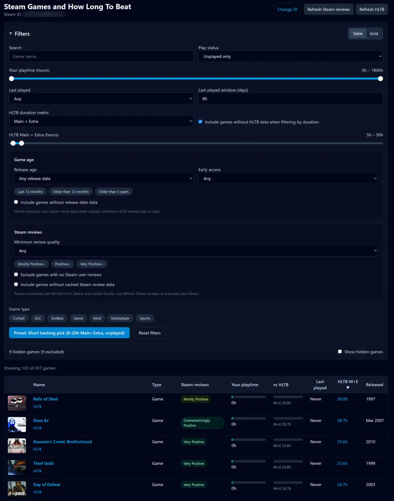
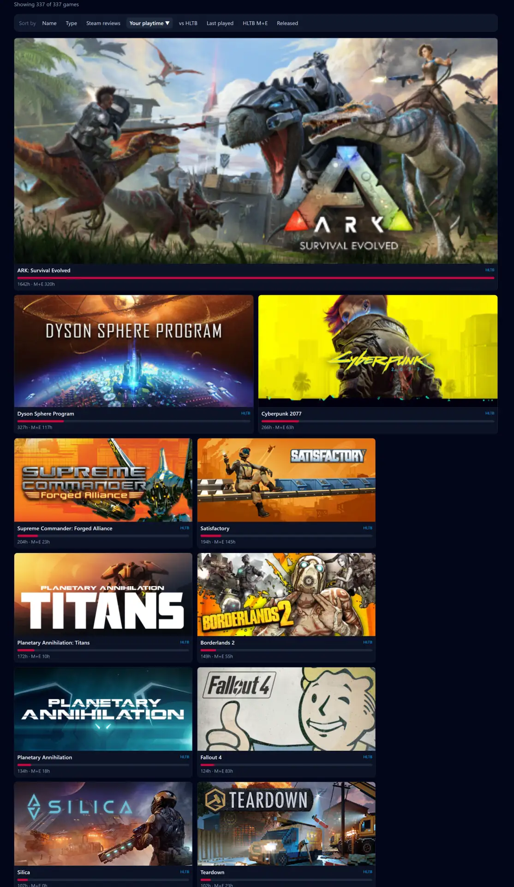
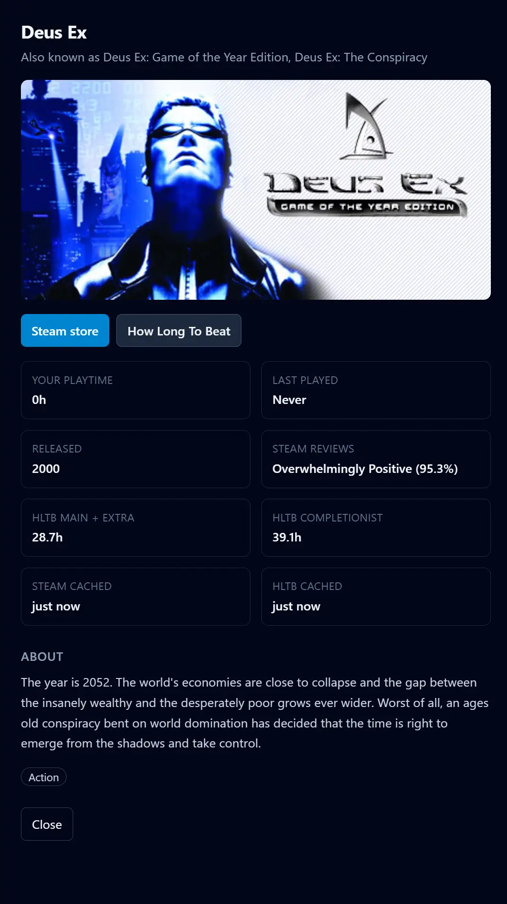

# HowLongToBeatYourSteam

A local view for your Steam library. It combines your playtime with [HowLongToBeat](https://howlongtobeat.com/) estimates, then helps you filter down to games worth playing next.

Built with **Flask** (API + cache) and **React + Tailwind + Radix UI** (frontend).

This was initially created by [Andrii S](https://github.com/Selfemra/HowLongToBeatYourSteam.git) 

It's been vibe coded in Cursor and updated by [Michael Kubler](https://github.com/kublermdk/HowLongToBeatYourSteam)

There's now a lot of filters, imagery, caching and other quality of life improvements.
It's helped me select my next games!

## What you get

- **Table view** — sortable backlog analyst with playtime bars, vs-HLTB progress, Steam/HLTB links, cache ages
- **Grid view** — card layout sized by how much you've played each game
- **Game detail drawer** — click a row or card for playtime, HLTB stats, Steam store blurb, and links
- **Filters** — play status, your playtime range, last played, HLTB duration (Main / Main+Extra / Completionist), game type
- **Filter persistence** — saved in localStorage and synced to URL query params for bookmarking
- **Preset** — “Short backlog pick” (8–20h Main+Extra, unplayed)
- **Caching** — Steam, HLTB, and header images cached locally
- **Hidden games** — optional filtering via your local Steam client config

## Requirements

- Python 3.10+
- Node.js 18+ (for building/running the frontend)
- A [Steam Web API key](https://steamcommunity.com/dev/apikey)
- A public Steam game library

## Setup

### 1. Python backend

```powershell
python -m venv .venv
.\.venv\Scripts\Activate.ps1
python -m pip install flask requests howlongtobeatpy
copy config.local.example.py config.local.py
```

Edit `config.local.py` — at minimum set `STEAM_API_KEY` and optionally `STEAM_ID`.

### 2. Frontend

```powershell
cd frontend
npm install
npm run build
cd ..
```

For development with hot reload:

```powershell
# Terminal 1
python app.py

# Terminal 2
cd frontend
npm run dev
```

Open http://localhost:5173 (Vite proxies `/api` to Flask on port 5000).

For production, Flask serves the built SPA from `frontend/dist/` after `npm run build`.

### 3. Run

```powershell
python app.py
```

Open http://127.0.0.1:5000

## Configuration

See `config.local.example.py` for all options. Key settings:

| Setting | Default | Description |
|--------|---------|-------------|
| `STEAM_API_KEY` | *(required)* | Steam Web API key |
| `STEAM_ID` | `''` | Pre-fill home page / auto-redirect |
| `CACHE_DIR` | `data/cache` | JSON cache per Steam account |
| `IMAGE_CACHE_DIR` | `data/images` | Cached Steam header images |
| `FETCH_STORE_METADATA` | `True` | Enable lazy Steam store description API |
| `CHECK_FOR_HIDDEN_GAMES` | `True` | Read hidden games from local Steam install |
| `SHOW_HIDDEN_GAMES` | `False` | Include hidden games when checking |

## API

| Route | Description |
|-------|-------------|
| `GET /api/config` | App config (default Steam ID, etc.) |
| `GET /api/library/:steamId` | Full cached library JSON |
| `GET /api/library/:steamId/sync` | SSE stream for HLTB sync progress |
| `GET /api/images/:appId` | Cached header image |
| `GET /api/games/:steamId/:appId/store` | Lazy Steam store metadata |

## Finding your Steam ID

Use the numeric ID from `https://steamcommunity.com/profiles/76561198…` or look it up at [steamid.io](https://steamid.io/).

## Troubleshooting

| Problem | What to check |
|--------|----------------|
| `Frontend not built` | Run `cd frontend && npm install && npm run build` |
| `Missing config.local.py` | Copy from `config.local.example.py` |
| No games returned | Public game library, valid Steam ID |
| Hidden detection fails | Set `STEAM_INSTALL_PATH` or disable with `CHECK_FOR_HIDDEN_GAMES = False` |

## Screenshots

### Filters and table view



### Grid view



### Game detail drawer


